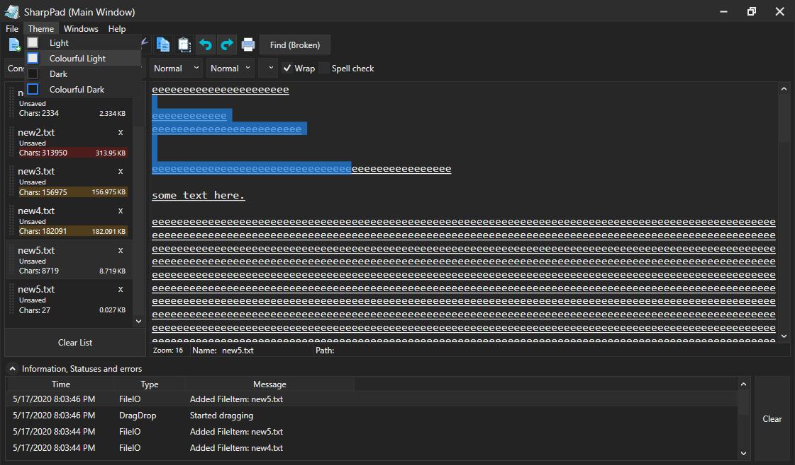

# SharpPad
Window's notepad is blindingly light themed, so i decided to make my own dark theme version with tabs and many other (probably useless) features. It uses WPF and MVVM (no MVVM Light or any nuget packages, i did it all myself). It's fairly robust, but it works. 
BTW, if you want to, you could improve the "messyness" of the code, cus i just splat things randomly into classes and never clean them up (most of the times). And, i dont think this program 100% follow the MVVM standards (maybe 90%), but who cares anyway ;)
Here's a snapshot of the program, showing the infolist at the bottom, multiple notepaditems and loads of text.

## Latest Updates
- Also fixed DragDropping slightly. Before, you could drag the entire NotepadItem. Now, you have to drag the grip (on the left of the item). This is makes sure you dont accidentally start dragging by accident
- Added ability to add extensions to file, or change the existing extension with another. can do this by right clicking the NotepadItem and at the bottom is a dropdown menu with a list of extensions. Nifty feature tbh, but kinda useless as you could just rename the file. oh well.
- Added a list at the bottom for errors, alerts and information the programs throws. Click the expander to show it. Also added an orange/red ribbon to the NotepadItems when the file size goes over 100kb/250kb, because at those points the program might lag.
- Added even more colourful icons, better than the other ones
- Added a Drag and Drop feature to the Notepaditems. you can drag them to a folder, and it creates a file with the specified extension at that location. can also be used to transfer notepaditems between different windows
- Added a light theme, and also colourful themes too (4 themes in total: colourful light and dark, and normal light and dark)
- Can open selected notepad in another window (VERY BROKEN, DONT USE. BREAKS THINGS). Update: I disabled this as it's too broken 
- Auto-prompts you to save unsaved/edited work/files when you exit. Click no to just exit
- Improved some other things ive forgotten about :/

## Errors:
I added a feature to open the selected notepad in another window. It's a bit broken. Try not to use it; closing the original mainwindow closes all other windows because of some error i couldnt fix. and some other things too. I added MainWindow to the titlebar, so that you know which window is which.

## Some 'code-level' info about it
the items on the left are a separate control (NotepadListItems, or NotepadItems), and their DataContext is a FileItemViewModel which contains a DocumentModel (containing path, filename, text, etc) and FormatModel (fontsize, wrapping, etc). When you select an item, it sets the main notepad view's DataContext as the selected NotepadItem's DataContext. and through binding, it updates the view accordingly.

## other things
it's completely opensource so you can edit it and stuff. would be nice if you credited me if you post it somewhere else (or dont... not too bothered tbh) :)
