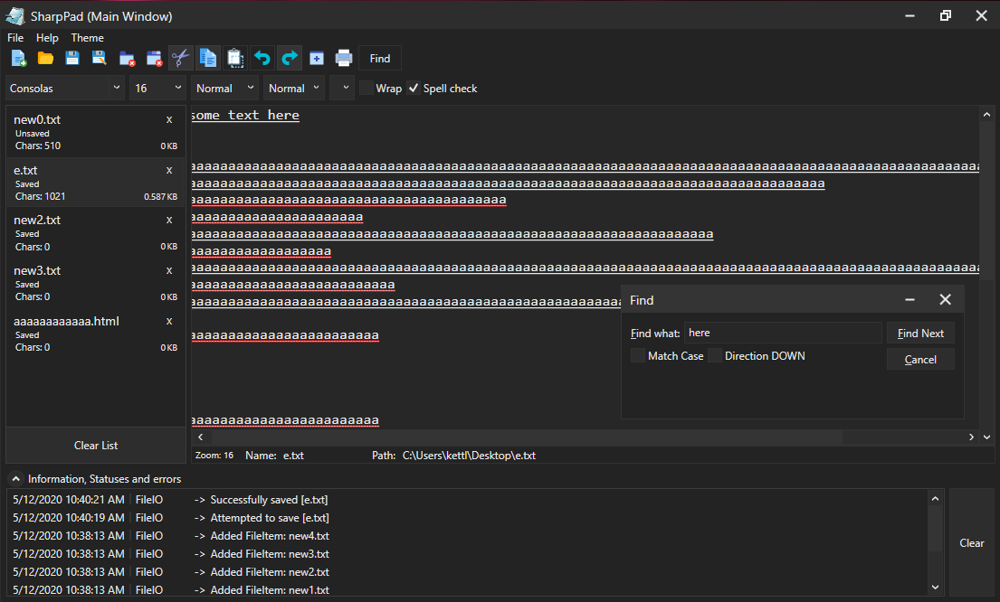

# SharpPad
Window's notepad is blindingly light themed, so i decided to make my own dark theme version with tabs. It uses WPF and MVVM (no mvvm light or similar things, i did it all myself). It's fairly robust, but it works. 
BTW, if anyone wants to help get the RichTextBox working then have a go. if you want to, you could improve the "messyness" too, cus i just splat things randomly into classes and never clean them up (most of the times)

## Some 'code-level' info about it
the items on the left are a separate control (NotepadListitems) , and their datacontext is a FileItemViewModel which contains a DocumentModel (containing path, filename, text, etc) and FormatModel (fontsize, wrapping, etc). When you select an item, it sets the main notepad view's datacontext as the item's datacontext you selected. and through binding, it updates the view accordingly.

## Errors:
I added a feature to open the selected notepad in another window. It's a bit broken, and by a bit i mean very broken. Try not to use it; closing the original mainwindow closes all other windows because of some error i couldnt fix because of a vs2017 bug not letting "ExitOnLastWindow" or something, work. and some other things too. I added a Main Window thing to the titlebar, so that you know which window is which. but overall, dont use it :) use 2 different windows but different "applications", aka double click the icon, and then use the drag and drop feature with the NotepadItems :)

## Latest Updates
- Added a RichTextBox bitt to it (still WIP, but you can have a look at it if you want; the 2 text editors are stuffed in a tabcontrol)#
- Added even more colourful icons, better than the other ones
- Added a Drag and Drop feature to the Notepaditems. you can drag them to a folder, and it creates a text file (.txt) at that location. can also be used to transfer notepaditems between different windows (be careful using relative-application windows... if thats even a real thing... i mean dont click the "Open in another window" button and then do it. open a new separate sharppad so they both say mainwindow and then dragdrop. that way you avoid some bugs im struggling to fix)
- Added light theme
- Can open selected notepad in another window (VERY BROKEN, DONT USE. BREAKS THINGS). Update: I disabled this as it's too broken 
- Auto-prompts you to save unsaved/edited work/files when you exit. Click no to just exit
- Improved some other things ive forgotten about :/

## other things
it's completely opensource so you can edit it and stuff. would be nice if you credited me if you post it somewhere else (or dont... not too bothered tbh) :)
